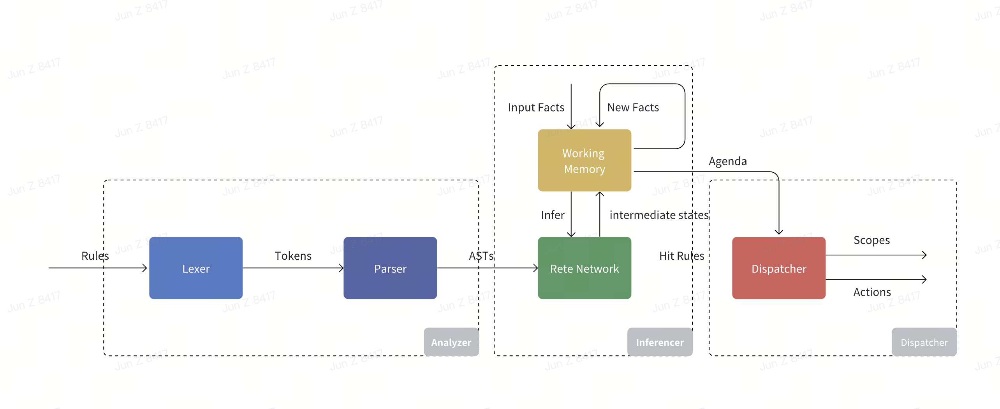

## MIA (Modular Inference Accelerator) Rule Engine 

MIA is a rule engine library for the Golang programming language. Inspired by the Drools for Java programming language, and MIA is done in a much lightweight manner for both I/O and process.

Like Drools, MIA has its own DSL for policy/rule drafting to use, and mainly focuses on compliance domain 

### Flow
- Input
   

- Output
  

### DSL
#### Basic
- Scope represents the permission or access granted to the user
```
GRANT $scope AS live.stream:allow WHEN $subject.age_status = "adult";
```
- Action is an executable statement, which includes both call and parameters for upstream execution
```
EXEC $action AS account:ban WITH retention:180 WHEN $subject.age_status = "underage";
```
- Fact is the new status or attribute of the subject or object, which will be used in the next round of inference process
```  
ADD $fact AS $subject.age_status:underage WHEN $subject.age < 14 AND ($subject.geo = "KR" OR $subject.geo = "TH" OR $subject.geo = "ID");
```
#### Extension
- Priority picks the decision with a higher priority if there are overlaps or conflicts 
```
ADD $fact AS $subject.age_status:underage WHEN $subject.age < 14 AND ($subject.geo = "KR" OR $subject.geo = "TH" OR $subject.geo = "ID") PRIORITY 1;
ADD $fact AS $subject.age_status:minor WHEN $subject.age <18 PRIORITY 2;
```
- Default picks the decision to make when all conditions fail to meet
```
DEFAULT GRANT $scope AS account:normal;
GRANT $scope AS account:banned WHEN $subject.age_status = "underage";
```

### AST 
Take the following rules as the example to show the AST
```
DEFAULT account:normal
ADD $fact AS $subject.age_status:underage WHEN $subject.age < 14 AND ($subject.geo = "KR" OR $subject.geo = "TH" OR $subject.geo = "ID");
GRANT $scope AS account:banned WHEN $subject.age_status = "underage";
```


### Engine

- ANTLR is used here as the lexer and parser to build the ASTs ( [ANTLR 4 Documentation](https://github.com/antlr/antlr4/blob/master/doc/index.md) )
- Rete network is used here as the optimization algorithm for result inference ( [Rete Algorithm](https://en.wikipedia.org/wiki/Rete_algorithm) )
- Drools-like implementation is adopted here for high performance of the engine ( [Drools Rule Engine](https://docs.drools.org/8.38.0.Final/drools-docs/docs-website/drools/rule-engine/index.html) )

### Rete Network
Take the following rules as the example to show the generated Rete network 
```
ADD $fact AS $subject.age_status:underage WHEN $subject.age < 14 AND ($subject.geo = "KR" OR $subject.geo = "ID");
ADD $fact AS $subject.age_status:underage WHEN $subject.age < 13 AND $subject.geo = "US";
ADD $fact AS $subject.age_status:adult WHEN $subject.age >= 18;
GRANT $scope AS account:kids_mode WHEN $subject.age_status = "underage" AND $subject.geo = "US" PRIORITY 1;
GRANT $scope AS account:banned WHEN $subject.age_status = "underage" PRIORITY 2;
```


### Usage
```Go
const POLICY = `
DEFAULT GRANT $scope AS account:normal; 
ADD $fact AS $subject.age_status:underage WHEN $subject.age < 14 AND ($subject.geo = "KR" OR $subject.geo = "ID");
ADD $fact AS $subject.age_status:underage WHEN $subject.age < 13 AND $subject.geo = "US";
ADD $fact AS $subject.age_status:adult WHEN $subject.age >= 18;
GRANT $scope AS account:kids_mode WHEN $subject.age_status = "underage" AND $subject.geo = "US" PRIORITY 1;
GRANT $scope AS account:banned WHEN $subject.age_status = "underage" PRIORITY 2;
`
e := engine.New(POLICY)
res := e.Eval("$subject.age", 13, "$subject.geo", "KR")
if res.Scopes["account"].Val() == "banned" {
    return false
}
```


### Benchmark
For the case of 5 rules with 2 inference iterations ([ex.](benchmark/policy.go))
```bash
goos: darwin
goarch: arm64
pkg: github.com/tiktok/mia-rule-engine/benchmark
cpu: Apple M1 Pro
BenchmarkEngine
BenchmarkEngine-10    	 1487048	       814.7 ns/op	    1216 B/op	      22 allocs/op
PASS
```